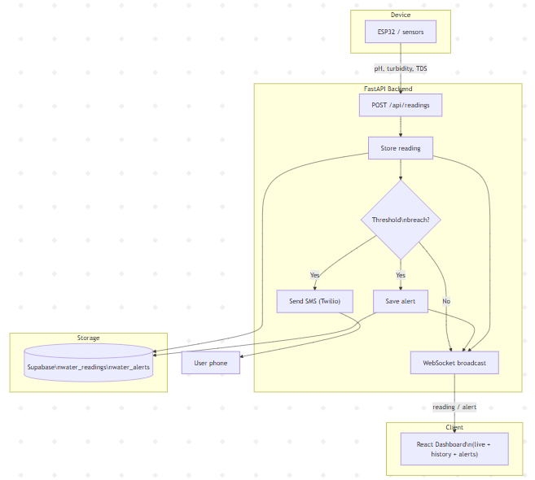

# JalSuraksha — Household Water Quality Monitoring

**जल सुरक्षा** · Smart monitoring for tank and tap water with real-time alerts.

A full-stack system that reads **pH**, **turbidity**, and **TDS** from an ESP32 (or simulator), stores readings in the cloud, and pushes live updates to a web dashboard. When quality goes out of safe range, it sends an **SMS alert** and records the event.

Built for the **जलमंथन (Jalamanthan)** hackathon — water quality track.

---

## Features

- **Real-time dashboard** — Live readings over WebSocket; no refresh needed
- **History & charts** — View past readings and trends (pH, turbidity, TDS)
- **SMS alerts** — Twilio notifies when pH / turbidity / TDS exceed safe limits
- **Persistent storage** — Supabase stores all readings and alerts for later analysis
- **ESP32-ready** — Wi‑Fi POST; optional SIM900A for offline SMS from the device
- **Test without hardware** — Python script to simulate sensor POSTs

---

## Architecture



More diagrams (Mermaid, sequence, state, data flow): [household-water-quality/docs/flow-diagram.md](household-water-quality/docs/flow-diagram.md).

---

## Tech Stack

| Layer      | Stack |
|-----------|--------|
| Device    | ESP32 (Arduino), pH / turbidity / TDS sensors, optional SIM900A |
| Backend   | FastAPI, Supabase (PostgreSQL), WebSocket, Twilio (SMS) |
| Frontend  | React, TypeScript, Vite, Recharts |

---

## Project Structure

```
household-water-quality/
├── esp32_water_quality/   # Arduino sketch — ESP32 Wi‑Fi POST + SIM900A SMS
├── backend/               # FastAPI app (readings, alerts, WebSocket)
│   ├── app/
│   │   ├── main.py
│   │   ├── config.py
│   │   ├── db.py
│   │   └── websocket_manager.py
│   └── supabase/
│       └── schema.sql      # Tables: water_readings, water_alerts
├── frontend/               # React dashboard (Vite + TS)
│   └── src/
│       ├── pages/          # Dashboard, History, Alerts
│       ├── components/
│       └── useLiveReadings.ts
├── scripts/
│   └── send_reading.py     # Simulate POST (no ESP32 needed)
└── docs/
    └── flow-diagram.md     # Mermaid diagrams
```

---

## Prerequisites

- **Python 3.10+** (backend)
- **Node.js 18+** (frontend)
- **Supabase** account (for persistent storage)
- **Twilio** account (optional; for SMS alerts)
- **ESP32** + sensors (or use the script to simulate)

---

## Quick Start

### 1. Backend

```bash
cd backend
pip install -r requirements.txt
```

Create a `.env` file (copy from below). Then:

```bash
uvicorn app.main:app --reload --port 8000
```

Backend runs at **http://localhost:8000**. Without Supabase it uses in-memory storage.

### 2. Frontend

```bash
cd frontend
npm install
npm run dev
```

Dashboard at **http://localhost:5173**. It proxies `/api` and `/ws` to the backend.

### 3. (Optional) Seed data without ESP32

```bash
# From project root
python scripts/send_reading.py --url http://localhost:8000
# Trigger an alert (bad values + SMS if Twilio configured):
python scripts/send_reading.py --url http://localhost:8000 --alert
```

### 4. ESP32

Open `esp32_water_quality/esp32_water_quality.ino` in Arduino IDE. Set:

- `WIFI_SSID`, `WIFI_PASSWORD`
- `API_URL` = `http://<your-pc-ip>:8000/api/readings` (use your machine’s LAN IP, not `localhost`)
- `ALERT_PHONE_NUMBER` (E.164, e.g. `+919876543210`) if using SIM900A

See [esp32_water_quality/README.md](esp32_water_quality/README.md) for wiring and calibration.

---

## Configuration

### Backend environment variables

| Variable | Required | Description |
|----------|----------|-------------|
| `SUPABASE_URL` | Yes* | Supabase project URL |
| `SUPABASE_SERVICE_ROLE_KEY` | Yes* | Service role key |
| `TWILIO_ACCOUNT_SID` | No | For SMS alerts |
| `TWILIO_AUTH_TOKEN` | No | For SMS alerts |
| `TWILIO_PHONE_NUMBER` | No | Sender phone number |
| `WATER_ALERT_PHONE_NUMBER` | No | Recipient for water alerts |

\* If Supabase is not set, the backend runs with in-memory storage (data lost on restart).

### Safe thresholds (backend)

- **pH:** 6.0 – 9.0  
- **Turbidity:** ≤ 100 NTU  
- **TDS:** ≤ 500 ppm  

Readings outside these ranges trigger an alert and (if configured) an SMS.

---

## API Summary

| Method | Endpoint | Description |
|--------|----------|-------------|
| GET | `/health` | Health + Supabase status |
| POST | `/api/readings` | Submit a reading (ESP32 / script) |
| GET | `/api/readings` | List readings (`?limit=`, `?device_id=`) |
| GET | `/api/readings/latest` | Latest reading |
| GET | `/api/alerts` | List alerts |
| GET | `/api/stats` | Counts and latest timestamp |
| WebSocket | `/ws` | Live updates (`reading` / `alert` messages) |

---

## Database (Supabase)

Run [backend/supabase/schema.sql](backend/supabase/schema.sql) in the Supabase SQL Editor to create:

- `water_readings` — one row per sensor POST  
- `water_alerts` — one row per threshold breach (SMS sent)

---

## License

MIT. Built for जलमंथन hackathon.
