# Household Water Quality – Mermaid Diagrams

## Whole architecture (single diagram)

---

## 1. High-level architecture (flowchart)

```mermaid
flowchart LR
    subgraph Device["🖥️ Device"]
        ESP32[ESP32 / Wi-Fi]
    end

    subgraph Backend["⚙️ FastAPI Backend"]
        API[POST /api/readings]
        DB[(Supabase)]
        WS[WebSocket /ws]
        SMS[SMS Twilio]
        API --> DB
        API --> WS
        API --> SMS
    end

    subgraph Client["🖼️ Client"]
        React[React Dashboard]
    end

    ESP32 -->|HTTP POST| API
    WS -->|broadcast reading/alert| React
```

---

## 2. Sequence: one reading (no alert)

---

## 3. Sequence: reading triggers alert (SMS + WebSocket)

---

## 4. React WebSocket lifecycle

---

## 5. Data flow (simplified)

---

You can paste any of these blocks into a Markdown file or a Mermaid-compatible viewer (e.g. GitHub, Notion, [Mermaid Live Editor](https://mermaid.live)).
